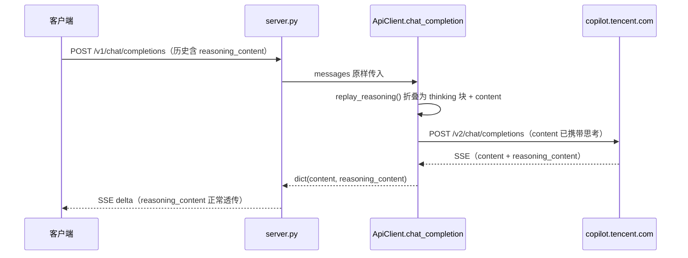

# 思考回放与 Codex 接入 · 交接文档

> 最后更新：2026-09-19（第三轮会话）
> 状态：思考回放修复已完成并通过真实上游验证；`tokens.json` 接入已补齐；Codex / Claude Code 经 CC Switch 接入（本项目无需改代码）
> 相关：[Codex 接入说明](codex-integration.md) ｜ [文档索引](README.md)

## 一句话结论

上游 `copilot.tencent.com/v2/chat/completions` 反序列化 `messages` 时只读
`role` / `content` / `tool_calls` 等白名单字段，assistant 历史消息上的 `reasoning_content`
被静默丢弃。本项目在发送前把历史思考折叠进 `content`（`<thinking>…</thinking>` 前缀）绕开该限制，
已用真实 token 复测确认生效。

## 快速自检

```bash
# 离线自检：不需要 token，不访问网络
python docs/verify_reasoning_replay.py          # 期望 7/7 passed

# 配置自检：确认 token 可加载（只输出到期时间/域名/uid）
python codebuddy_direct_api.py --check-token

# 真实链路：需要 token，会调用上游
python docs/probe_reasoning_replay.py replay    # 思考回放 A/B 对比
python docs/probe_reasoning_replay.py models    # 模型可用性扫描
```

## 真实上游验证结论（2026-09-18）

场景：上一轮 assistant 历史里植入暗号 `ZEBRA-9173`，下一轮提问暗号。

| 组 | 发给上游的 assistant content | prompt_tokens | 模型回答 |
|---|---|---|---|
| A 折叠回放（修复后） | `<thinking>` + 暗号 + `</thinking>` + 原文 | **64** | `ZEBRA-9173` ✅ |
| B 原始发送（修复前） | 仅原文 | 44 | 「你刚才没有告诉我任何暗号。」❌ |

`prompt_tokens` 差值 20，证明折叠后的思考确实进入了底座编码；B 组复现了原始缺陷。
代理层端到端同样通过：`POST /v1/chat/completions` 返回 200 且答出暗号，`/health` 为
`{"status":"ok","codebuddy_configured":true}`。

## 本仓库当前能力边界

| 能力 | 状态 |
|------|------|
| Chat Completions `/v1/chat/completions`（SSE 流式 + `reasoning_content` 下行） | ✅ 可用 |
| 图片生成 / 图片编辑 | ✅ 可用 |
| `tokens.json` 配置 | ✅ 已接入 |
| 模型清单 `/v1/models` | ✅ 可用；4 个上游已下架模型已移除（见 F-004） |
| Responses API `/v1/responses` | ❌ 未实现，且**不需要**：协议转换由 CC Switch 承担，见 F-005 |
| 上游 `usage` 透出 | ❌ 被丢弃，仓库内无法做 token 级断言 |

## 变更清单（两轮会话累计）

| 文件 | 位置 | 改动 |
|------|------|------|
| `codebuddy_direct_api.py` | `:131` | `REPLAY_REASONING` / `REASONING_TAG` / `REASONING_FIELDS` |
| `codebuddy_direct_api.py` | `:352` | `extract_reasoning()`：兼容 `reasoning_content` / `reasoning` / `thinking`（含 Anthropic thinking 块） |
| `codebuddy_direct_api.py` | `:373` | `replay_reasoning()`：折叠 + 幂等 + 透传规则 |
| `codebuddy_direct_api.py` | `:577` | 唯一调用点（`ApiClient.chat_completion()` 组装请求体处），流式 / 非流式共用 |
| `codebuddy_direct_api.py` | `:1092` | CLI 多轮历史保留 `reasoning_content`，下一轮由同一逻辑回放 |
| `codebuddy_direct_api.py` | `:257` / `:333` | `extract_token_from_tokens_file()` 并接入 `find_and_load_token()` |
| `codebuddy_direct_api.py` | `:91` | `TOKENS_FILE`（默认项目根目录 `tokens.json`，可用 `WORKBUDDY_TOKENS_FILE` 覆盖） |
| `codebuddy_direct_api.py` | `:67` / `:74` | `AUTH_FILE_PATHS` 补 Windows 桌面端路径（`%APPDATA%` / `%LOCALAPPDATA%`） |
| `server.py` | `:82` / `:93` | 改为懒初始化，不再因缺少 `CODEBUDDY_AUTH_TOKEN` 而放弃初始化 |
| `server.py` | `:309` | `/health` 的 `codebuddy_configured` 改为反映真实客户端状态 |
| `README.md` / `README.en.md` | 特性、环境变量表、模型清单、Codex 接入 | 同步文档 |
| `docs/` | 本文件、Codex 说明、两个自检脚本 | 新增 |

### `tokens.json` 为什么必须改

改之前 `find_and_load_token()` 只认 `CODEBUDDY_AUTH_TOKEN` 环境变量和桌面端
`workbuddy-desktop.info`，仓库里的 `tokens.json` **从未被任何代码读取**；`server.py` 还用环境变量
做了前置判断，所以「填好 `tokens.json` 就能跑」在原代码下不成立（表现为 503 或
`codebuddy_configured: false`）。

现在支持的加载优先级：`CODEBUDDY_AUTH_TOKEN` 环境变量 > `--auth-file` > `tokens.json` > 桌面端 auth 文件。

`tokens.json` 结构（取第一个带 `token_info` 的条目，`name` 任意）：

```json
{
  "tokens": [{"name": "any-name", "token_info": {"access_token": "<YOUR_TOKEN>"}}],
  "updated_at": "1970-01-01T00:00:00"
}
```

缺失的 `user_id` / `domain` / 过期时间会从 JWT 推导。`tokens.json` 已在 `.gitignore` 中，**不要提交**。
## 数据流



## 设计取舍（不要轻易推翻）

- **折叠进 `content`，而非插入新消息**：上游 Chat Template 对消息序列敏感，额外 system / user 消息会改变渲染并打乱 tool_call 与轮次的配对；`content` 是唯一被保证读取的承载位。
- **用 `<thinking>` 标签包裹**：模型能识别为「上一轮自己的思考」，也便于需要时用正则剥离；标签名集中在 `REASONING_TAG`。
- **折叠后删除扩展字段**：它们已被证实被丢弃，留着会造成「已生效」的误判；若上游将来支持 `reasoning_content`，同时保留会导致思考被编码两次。
- **幂等检查**：部分客户端会把思考内联进 `content`（如 thinking 标签块），重复注入会双倍消耗 token。
- **跳过非字符串 `content`**（多模态块）：宁可不回放，也不破坏请求结构。
- **收口在 `chat_completion()`**：流式与非流式共用一条路径，避免以后新增分支时漏改。

## 问题与根因

**现象（客户端视角）**：下行正常（SSE 产出思考并渲染折叠块），上行丢失（客户端回传的
`reasoning_content` 模型感知不到）。

**根因**：上游网关向底座模型组装 Jinja / Chat Template 时只映射标准字段
（`role` / `content` / `tool_calls`），消息里的 `reasoning_content` 不进入推理上下文。

**影响面**：所有会把历史思考回传的客户端（DeepSeek Harness、OpenCode/OMP、Claude Code、
Cherry Studio 等）在多轮场景丢思考；单轮输出不受影响。

## Evidence → Finding → Path

### E-001

- title: 离线自检 7/7 通过
- observed_at: 2026-09-18
- source_type: command
- source_ref: `python docs/verify_reasoning_replay.py`
- content_hash: 5d3df917abb1ede4b3d99b55e2241dbeb979eb46a1ee3691dfadfa87521469d0
- artifact_path: docs/verify_reasoning_replay.py
- repro_command: |
    python docs/verify_reasoning_replay.py
- raw_excerpt: |
    [ OK ] folds_reasoning_into_content -> '<thinking>\n暗号是 ZEBRA\n</thinking>\n\n答案是 4'
    [ OK ] idempotent_when_already_inlined -> same object returned
    [ OK ] keeps_tool_calls_with_null_content -> '<thinking>\nR\n</thinking>'
    [ OK ] supports_anthropic_style_thinking_blocks -> '<thinking>\nT1\n\nT2\n</thinking>\n\nC'
    [ OK ] leaves_multimodal_content_untouched -> list content preserved
    [ OK ] toggle_disables_replay -> replay off -> passthrough
    [ OK ] chat_completion_sends_folded_messages -> '<thinking>\nRC\n</thinking>\n\nA'

    7/7 passed
- linked_workitem: WI-001
- supersedes: none

### E-002

- title: 端到端抓取真实请求体（mock 上游连接层）
- observed_at: 2026-09-18
- source_type: command
- source_ref: `docs/verify_reasoning_replay.py :: chat_completion_sends_folded_messages`
- content_hash: 5d3df917abb1ede4b3d99b55e2241dbeb979eb46a1ee3691dfadfa87521469d0
- artifact_path: docs/verify_reasoning_replay.py
- repro_command: |
    python docs/verify_reasoning_replay.py
- raw_excerpt: |
    断言 chat_completion() 实际发出的 body 中：
    messages[0]["content"] == "<thinking>\nRC\n</thinking>\n\nA"、不含 reasoning_content、
    messages[1] 仍为原始 user 消息。
- linked_workitem: WI-001
- supersedes: none

### E-003

- title: 服务可启动并响应健康检查
- observed_at: 2026-09-18
- source_type: command
- source_ref: `python server.py` + `GET /health`
- content_hash: n/a
- artifact_path: n/a
- repro_command: |
    $env:PORT = '8124'; $env:API_KEY = 'test-key'
    python server.py            # 另开一个终端
    Invoke-WebRequest -Uri 'http://127.0.0.1:8124/health' -UseBasicParsing
- raw_excerpt: |
    {"status":"ok","codebuddy_configured":true,"api_key_configured":true}
- linked_workitem: WI-001
- supersedes: none
### E-004

- title: 上游静默丢弃 reasoning_content（用户报告）
- observed_at: 2026-09-18（用户实测）
- source_type: manual
- source_ref: 用户直连 `/v2/chat/completions` 的对比测试
- content_hash: n/a
- artifact_path: n/a
- repro_command: |
    见 E-006（本仓库已提供等价的可复现脚本）
- raw_excerpt: |
    上一轮 assistant 消息中注入 500 字思考 → 下一轮 prompt_tokens 增量精确为 0；
    在上一轮思考中植入暗号 → 下一轮模型回复 NONE，并在思考流中否认「上轮提及暗号」。
- linked_workitem: WI-001
- supersedes: none

### E-005

- title: 关键源码指纹（思考回放 + tokens.json 接入后）
- observed_at: 2026-09-18
- source_type: file
- source_ref: `codebuddy_direct_api.py`
- content_hash: a4decf3d0e252a5d097bbc20aaeb69eb315a644c2d067d372c073bc8bacd1692
- artifact_path: codebuddy_direct_api.py
- repro_command: |
    Get-FileHash -Algorithm SHA256 .\codebuddy_direct_api.py
- raw_excerpt: |
    工作区字节（CRLF）SHA-256。指纹变化说明该文件在此文档之后被再次修改。
- linked_workitem: WI-001
- supersedes: none

### E-006

- title: 真实上游 A/B 复测：折叠回放 vs 原始发送
- observed_at: 2026-09-18
- source_type: command
- source_ref: `python docs/probe_reasoning_replay.py replay`
- content_hash: 406992346f32fdfff017b58211bfdc64c594189727452d2360832767256b002d
- artifact_path: docs/probe_reasoning_replay.py
- repro_command: |
    python docs/probe_reasoning_replay.py replay
- raw_excerpt: |
    A_折叠回放     prompt_tokens=   64  答出暗号=True
               answer = 'ZEBRA-9173'
    B_原始发送     prompt_tokens=   44  答出暗号=False
               answer = '你刚才没有告诉我任何暗号。'
    ----------------------------------------------------------------
    prompt_tokens 差值 (A - B) = 20
    判定：PASS —— 折叠后思考进入上下文，原始发送复现丢弃
- linked_workitem: WI-001
- supersedes: none

### E-007

- title: tokens.json 接入后 token 可正常加载
- observed_at: 2026-09-18
- source_type: command
- source_ref: `python codebuddy_direct_api.py --check-token`
- content_hash: n/a
- artifact_path: n/a
- repro_command: |
    在项目根目录放好 tokens.json 后执行：
    python codebuddy_direct_api.py --check-token
- raw_excerpt: |
    [✓] Token 已加载 (uid=xxxxxxxx-xxx...)
    [*] Token 有效期: 55 天 (2026-11-12)
    [✓] Token 有效
    Domain:  www.codebuddy.cn
    Type:    personal
- linked_workitem: WI-002
- supersedes: none

### E-008

- title: 全量模型可用性体检
- observed_at: 2026-09-18
- source_type: command
- source_ref: `python docs/probe_reasoning_replay.py models`
- content_hash: 406992346f32fdfff017b58211bfdc64c594189727452d2360832767256b002d
- artifact_path: docs/probe_reasoning_replay.py
- repro_command: |
    python docs/probe_reasoning_replay.py models
- raw_excerpt: |
    可用 24 / 不可用 4 / 跳过 1
      x deepseek-r1-0528 -> model [deepseek-r1-0528] service info not found
      x deepseek-v3-1 -> model [deepseek-v3-1] service info not found
      x glm-4.7 -> model [glm-4.7] service info not found
      x glm-5.0 -> model [glm-5.0] service info not found
    （hy3-preview-agent 为收费模型，默认跳过未测）
- linked_workitem: WI-003
- supersedes: none

### E-009

- title: Codex 0.155.0 仅支持 Responses 线路；本机 10001 为 CC Switch 且上游 401
- observed_at: 2026-09-18
- source_type: command
- source_ref: `codex exec`（临时 CODEX_HOME）+ `POST http://127.0.0.1:10001/v1/responses`
- content_hash: n/a
- artifact_path: n/a
- repro_command: |
    # 1) 探 wire_api 合法取值（写成非法值即可看到枚举）
    #    临时 CODEX_HOME 下配置 [model_providers.custom] wire_api = "bogus"
    codex exec --skip-git-repo-check "hi"
    # 2) 看 10001 是什么服务
    curl -s http://127.0.0.1:10001/v1/models
- raw_excerpt: |
    Error loading config.toml: unknown variant `bogus`, expected `responses`
    in `model_providers.custom.wire_api`

    GET  http://127.0.0.1:10001/v1/models        -> {"models":[]}
    GET  http://127.0.0.1:10001/health           -> {"status":"healthy",...}
    POST http://127.0.0.1:10001/v1/responses     -> HTTP 401
         {"error":{"message":"CC Switch local proxy failed while handling Codex endpoint
          /responses. Provider: agent-hx-ds-v4 copy; model: deepseek-v4-flash;
          upstream_status: HTTP 401; cause: unauthorized client detected, ..."}}
- linked_workitem: WI-004
- supersedes: none
### F-001

- title: 上游白名单反序列化导致历史思考不进入底座上下文
- severity: medium
- category: design
- status: validated
- evidence_ids: [E-004, E-006]
- location: `copilot.tencent.com/v2/chat/completions`（网关消息体反序列化）
- impact: 多轮对话丢失前序推理，模型记忆与注意力断裂
- confidence: high
- repro_steps:
  1. `python docs/probe_reasoning_replay.py replay`
  2. 观察 B 组（原始发送）答不出暗号、`prompt_tokens` 更低
- remediation: 已在代理层折叠回放（`replay_reasoning()`）；上游侧无法修改
- optional_attack:

### F-002

- title: 代理层折叠实现符合设计，流式 / 非流式接线正确
- severity: info
- category: design
- status: validated
- evidence_ids: [E-001, E-002, E-003]
- location: `codebuddy_direct_api.py:373`、`codebuddy_direct_api.py:577`
- impact: 上游请求体中历史思考随 `content` 一并发送，扩展字段不再残留
- confidence: high
- repro_steps:
  1. `python docs/verify_reasoning_replay.py`
  2. 7 个用例全部通过（用例 7 抓取了 `chat_completion()` 实际发出的 body）
- remediation: n/a
- optional_attack:

### F-003

- title: 折叠后的思考确实被上游编码（真实链路已确认）
- severity: info
- category: other
- status: validated
- evidence_ids: [E-006, E-003]
- location: `copilot.tencent.com/v2/chat/completions`
- impact: 修复在真实链路上生效：`prompt_tokens` 64 vs 44，暗号问答由失败转为成功
- confidence: high
- repro_steps:
  1. `python docs/probe_reasoning_replay.py replay`
- remediation: n/a
- optional_attack:

### F-004

- title: `/v1/models` 与 README 中 4 个模型上游已下架（已移除）
- severity: low
- category: misconfig
- status: fixed
- evidence_ids: [E-008]
- location: `codebuddy_direct_api.py` `KNOWN_CHAT_MODELS` / `THINKING_CAPABLE_MODELS`、`README.md` 模型清单
- impact: 客户端选中这些模型会直接收到上游 400；`/v1/models` 的清单不完全可信
- confidence: high
- repro_steps:
  1. `python docs/probe_reasoning_replay.py models`
  2. 观察 4 条 `service info not found`
- remediation: 已修复（2026-09-19）—— 从 `KNOWN_CHAT_MODELS` 与 `THINKING_CAPABLE_MODELS`
  移除这 4 个模型；保留名称相近但实测可用的 `deepseek-r1-0528-lkeap` /
  `deepseek-v3-1-lkeap` / `glm-5.0-turbo`。`/v1/models` 现返回 28 个模型
- optional_attack:

### F-005

- title: Codex 不能以 Responses API 直连本项目（需经 CC Switch 协议转换）
- severity: medium
- category: design
- status: resolved
- evidence_ids: [E-009]
- location: `server.py`（现有路由）
- impact: Codex 0.155.0 的 `wire_api` 只接受 `responses`，本项目只提供
  `/v1/chat/completions`，因此 Codex 不能**直连**本服务（可用 CC Switch 中转，见 remediation）
- confidence: high
- repro_steps:
  1. 临时 `CODEX_HOME` 下把 `model_providers.custom.wire_api` 写成非法值并 `codex exec`
  2. 观察报错只列出 `responses`
- remediation: 已解决，且**不需要改代码** —— 由 CC Switch 本地代理承担协议转换：
  把本项目作为 `apiFormat = openai_chat` 的 provider 加进 CC Switch，Codex 与 Claude Code
  均走该路线。字段填法与排错见 `docs/codex-integration.md`
- optional_attack:

### P-001

- title: 客户端历史思考到上游上下文的调用路径（callflow）
- path_type: callflow
- start: 客户端回传历史 `messages`（assistant 项带 `reasoning_content`）
- goal: 该思考进入上游 Chat Template，被底座模型编码
- steps:
  1. action: 客户端在 assistant 历史项带回 `reasoning_content` — evidence: E-004 — finding: F-001
  2. action: `server.py` 校验后原样把 `messages` 交给 `ApiClient.chat_completion()` — evidence: E-002 — finding: none
  3. action: `replay_reasoning()` 折叠为思考块前缀写入 `content` 并移除扩展字段 — evidence: E-001, E-002 — finding: F-002
  4. action: 折叠后的 body 发往 `/v2/chat/completions`，进入上游 Chat Template — evidence: E-006 — finding: F-003
- residual_risks: 折叠会增大 assistant 消息的 token 占用；上游若对 content 有截断策略，回放可能不完整（未观察到）

## 已知边界与风险

- **Codex 需经 CC Switch 接入**：Codex 只支持 Responses API（F-005），但**不需要改本项目代码** ——
  由 CC Switch 本地代理做协议转换，见 [codex-integration.md](codex-integration.md)。
- **token 成本上升**：历史思考现在会被真正编码，长会话 `prompt_tokens` 高于修复前，属预期代价。
- **不影响下行展示**：折叠只发生在上行请求体，客户端收到的 `content` 仍是模型原始回答。
- **多模态轮次不回放**：`content` 为块数组时跳过折叠（有意为之）。
- **4 个模型上游已下架且已移除**（F-004），`hy3-preview-agent` 为收费模型未测。
- **`_conversation_id` 仍在回传**：上游可能同时维护服务端会话状态，与折叠叠加时的行为未单独验证。
- **既有问题（未修）**：`server.py:70` 读取了 `DEFAULT_THINKING`，但流式路径默认值写死为 `"max"`，该环境变量实际不生效。

## 下一步待办

**P0 — 在 Codex / Claude Code 中使用这些模型**

- 路线已确定（2026-09-19）：**不改本项目代码**，由 CC Switch 本地代理承担协议转换。
  启动本项目（`.\start.ps1`）→ 在 CC Switch 新增 `apiFormat = openai_chat` 的 provider
  （base_url = `http://127.0.0.1:8000/v1`）→ 切换供应商 → Codex / Claude Code 即可使用。
  字段填法与排错见 `docs/codex-integration.md`。

**P1 — 可观测性**

- `chat_completion()` 丢弃了上游 `usage`（上游每个 SSE chunk 都带，含 `prompt_tokens`）。
  建议透出到 `/v1/chat/completions` 的响应与 SSE 收尾块，便于做 token 级断言与成本统计。

**P1 — 失效模型处置**

- 决定 `deepseek-r1-0528` / `deepseek-v3-1` / `glm-4.7` / `glm-5.0`：从 `KNOWN_CHAT_MODELS` 移除，
  或保留但在 `/v1/models` 与 README 中标注「上游不可用」。

**P2 — 开关粒度**

- `REPLAY_REASONING` 只有全局环境变量；多客户端共用实例时建议支持请求级覆盖
  （如 body 中 `replay_reasoning: false`）。

**P2 — 成本控制**

- 若长会话 token 压力明显，可只回放最近 N 轮思考（在 `replay_reasoning()` 内按索引过滤）。

## 关键代码索引

| 位置 | 作用 |
|------|------|
| `codebuddy_direct_api.py:67` / `:74` | `AUTH_FILE_PATHS` 与 Windows 桌面端路径 |
| `codebuddy_direct_api.py:91` | `TOKENS_FILE` 路径解析 |
| `codebuddy_direct_api.py:131` | 思考回放相关常量 |
| `codebuddy_direct_api.py:257` | `extract_token_from_tokens_file()` |
| `codebuddy_direct_api.py:308` | `find_and_load_token()`：token 加载优先级 |
| `codebuddy_direct_api.py:352` | `extract_reasoning()` |
| `codebuddy_direct_api.py:373` | `replay_reasoning()`：折叠 / 幂等 / 透传 |
| `codebuddy_direct_api.py:577` | 唯一调用点（`ApiClient.chat_completion()`） |
| `codebuddy_direct_api.py:912` | `_parse_sse_stream()`：下行 `reasoning_content`（未改动） |
| `codebuddy_direct_api.py:1092` | CLI 多轮历史保留思考 |
| `codebuddy_direct_api.py:1107` | `KNOWN_CHAT_MODELS` 模型清单 |
| `server.py:82` / `:93` | 懒初始化客户端 |
| `server.py:259` | 流式响应先发 `reasoning_content` delta（下行，未改动） |
| `server.py:309` | `/health` 的配置状态字段 |
| `docs/verify_reasoning_replay.py` | 离线自检（7 个用例） |
| `docs/probe_reasoning_replay.py` | 真实链路探测（replay / models） |

## 术语

| 术语 | 含义 |
|------|------|
| 思考 / reasoning | 模型在正式回答前的推理文本，OpenAI 兼容字段为 `reasoning_content` |
| 折叠 / 回放 | 把历史 `reasoning_content` 前置进 assistant 的 `content`，使其随消息体上传 |
| 白名单字段 | 上游网关真正读取的字段：`role` / `content` / `tool_calls` |
| `prompt_tokens` | 上游对输入上下文的计量；修复前历史思考的增量为 0，是丢弃的直接证据 |
| Responses API | OpenAI 新版接口 `/v1/responses`；Codex 0.155.0 只支持该线路 |