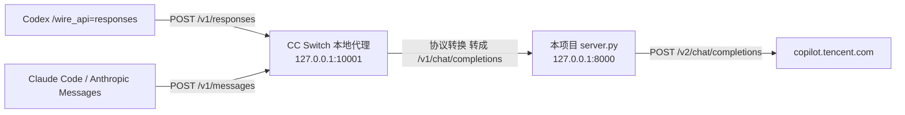

# 在 Codex / Claude Code 中使用（经 CC Switch 协议转换）

> 最后更新：2026-09-23
> 相关：[文档索引](README.md) ｜ [Fork 变更记录](FORK-CHANGES.md) ｜ [上游 11128 拦截 Claude Code](2026-09-23_upstream-11128-claude-code-block.md)

## 一句话结论

**Codex 可以接入，Claude Code 不行**，本项目都不需要改代码。

> ⚠️ **2026-09-23 实测更正**：上游网关会**按请求内容**识别客户端身份，`messages` 里带上
> Claude Code 系统提示词的首句（`You are Claude Code, Anthropic's official CLI for Claude.`）
> 就返回 `400 {"code":11128,"msg":"Illegal API invocation from an unapproved channel"}`
> （「请求被安全策略拦截」）。Claude Code 的每个请求都带那句，所以**无论经 CC Switch、
> 直连本项目还是直连上游，都会被拦**；换 header / API Key / 模型都无效。
> Codex 与提示词中性的客户端不受影响。排查过程与证据见
> [2026-09-23_upstream-11128-claude-code-block.md](2026-09-23_upstream-11128-claude-code-block.md)。

Codex 0.155.0 只会说 Responses API（`wire_api` 的合法取值只有 `responses`），而本项目只提供
OpenAI Chat Completions（`/v1/chat/completions`）。这段协议差异交给 **CC Switch 的本地代理**：

CC Switch 支持把 `apiFormat` 为 `openai_chat` 的服务当作上游，会自动把客户端发来的
Responses / Anthropic 请求转换后再转发。所以只要把本项目作为一个 `openai_chat` provider
加进 CC Switch 就行。



> 图中 **Claude Code 那条路自 2026-09-23 起被上游按内容拦截**（见上方警告），
> **Codex 那条仍然可用**。

## 一、先启动本项目

Windows（PowerShell）：

```powershell
.\start.ps1                    # 默认 8000 端口
.\start.ps1 -Port 9000         # 换端口
```

Linux / macOS：

```bash
./start.sh                     # 默认 8000 端口
PORT=9000 ./start.sh
```

**API Key 通常不用手动设**：一键启动脚本按「环境变量 `API_KEY` → 项目根目录
`apikey.local` → 自动生成随机 key 并写入 `apikey.local`」取值，启动时把最终 key 打印在
banner 里，直接抄进 CC Switch 的 apiKey 字段即可（该文件已在 `.gitignore` 中）。

想自己指定就显式设环境变量（优先级最高）：

```powershell
$env:API_KEY = "你自定的 key"
.\start.ps1
```

确认服务活着：

```bash
curl http://127.0.0.1:8000/health
# {"status":"ok","codebuddy_configured":true,"api_key_configured":true}
```

| 字段 | 期望 | 含义 |
|---|---|---|
| `codebuddy_configured` | `true` | token 加载成功（来自 `tokens.json` 或 `CODEBUDDY_AUTH_TOKEN`） |
| `api_key_configured` | `true` | 已设置 `API_KEY`，调用需带 `Authorization: Bearer <key>` |

## 二、在 CC Switch 里新增 provider

CC Switch → 新增供应商。**唯一要点：接口格式必须选 `openai_chat`。**

| CC Switch 字段 | 填什么 | 说明 |
|---|---|---|
| 应用 / App | `Codex`（推荐） | 想在 Codex 用就选 Codex。**不要选 Claude**：Claude Code 会带身份提示词，必被上游 11128 拦截 |
| 名称 / Name | `WorkBuddy2API` | 随便起，只是个标签 |
| 接口格式 / API Format | **`openai_chat`** | 关键项。本项目是 OpenAI Chat Completions 兼容 |
| 基础地址 / Base URL | `http://127.0.0.1:8000/v1` | 端口要和 `start.ps1 -Port` 一致，**结尾必须带 `/v1`** |
| API Key | 启动 banner 里打印的 `API_KEY`（即 `apikey.local` 里的值） | 由一键启动脚本自动生成，抄 banner 即可 |
| 模型 / Model | `deepseek-v4-pro` 等 | 见第三节 |

界面上中英文叫法可能不同，认准底层字段名：`apiFormat` / `base_url` / `apiKey` / `model`。

> 若界面提供「拉取模型列表」，先启动本项目再点，会直接读到 `/v1/models` 的 28 个模型。

然后：

1. 确认 CC Switch 的 **本地代理（Local Proxy）** 已开启，监听 `127.0.0.1:10001`。
2. 把 Codex（或 Claude）的当前供应商切换成刚新增的 `WorkBuddy2API`。

切换后 CC Switch 会自动改写 `~/.codex/config.toml`（**不需要手动改**），形如：

```toml
model_provider = "custom"
model = "deepseek-v4-pro"

[model_providers.custom]
wire_api = "responses"
base_url = "http://127.0.0.1:10001/v1"
experimental_bearer_token = "PROXY_MANAGED"
```

注意 `wire_api` 仍是 `responses`、`base_url` 指向 10001：Codex 说的依然是 Responses API，
转换发生在 CC Switch 本地代理那一侧。**本项目收到的是已经转换好的 `/v1/chat/completions`。**

## 三、选哪个模型

模型名直接用 `/v1/models` 返回的名字。按 **2026-09-23 全量复测**（`--probe-thinking`）：

| 类别 | 模型 |
|---|---|
| 有 `reasoning_content` 下行（推荐） | `deepseek-v4-flash`、`deepseek-v4-pro`、`deepseek-v3-2-volc`、`deepseek-r1`、`deepseek-r1-0528-lkeap`、`deepseek-v3-1-lkeap`、`glm-5.1`、`glm-5.2`、`glm-5.0-turbo`、`glm-5v-turbo`、`kimi-k2.5`、`kimi-k2.6`、`kimi-k2.7`、`kimi-k3-1`、`minimax-m2.7`、`hunyuan-2.0-thinking`、`hy3`、`hy3-preview`、`hy4-preview`、`auto`；另有 `hy3-preview-agent`（收费，本次未复测） |
| 未观察到思考 | `deepseek-v3-0324-lkeap`、`hunyuan-chat`、`hunyuan-2.0-instruct` |
| 上游已下架（不在清单里，但客户端目录仍显示） | `glm-4.6`、`glm-4.6v`、`glm-4.7`、`glm-5.0`、`kimi-k2-thinking`、`minimax-m2.5`、`deepseek-r1-0528`、`deepseek-v3-1`、`deepseek-v3-1-volc`、`default-1.1/1.2` 等 17 个 |

想看到折叠的思考块，优先选第一类。

两点实测补充：

- `deepseek-v3`、`deepseek-v3-0324` 在 `low` 深度下没观察到 `reasoning_content`，但入参被
  上游接受（HTTP 200），无法据此否定，注册表里**保留**其思考标记。
- 客户端模型选择器里的目录来自上游 `/v3/config`，**不等于可调用清单**：上表第三类在
  客户端里照样显示，调用却返回 `model service info not found`；反过来第一类里
  `deepseek-v4-pro`、`hy4-preview`、`kimi-k2.7` 等客户端目录里根本没有。一律以
  `/v1/models` 为准。

## 四、验证

```bash
# 1. 本项目直连（绕过 CC Switch）；/v1/models 需要鉴权
curl -H "Authorization: Bearer $(cat apikey.local)" http://127.0.0.1:8000/v1/models

# 2. CC Switch 本地代理是否活着（无需鉴权）
curl http://127.0.0.1:10001/health

# 3. Codex 走通最小闭环
codex exec --skip-git-repo-check "say hi"
```

PowerShell 里读 key：

```powershell
curl.exe -H "Authorization: Bearer $(Get-Content apikey.local)" http://127.0.0.1:8000/v1/models
```

多轮思考回放是否生效（需要 token，会真实调用上游）：

```bash
python docs/probe_reasoning_replay.py replay   # 期望 PASS
```

## 五、排错

| 现象 | 原因 / 处理 |
|---|---|
| 日志出现 `[!] API 错误 400: {"code":11128,...unapproved channel}`；本地侧表现为 `502 {"detail":"Upstream API returned empty response"}`（流式时 HTTP 状态已是 200，错误藏在流里） | **上游安全策略拦截，不是本项目故障**：请求内容里带了 Claude Code 的身份提示词。Claude Code 请改用别的 provider；排查过程与证据见 [2026-09-23_upstream-11128-claude-code-block.md](2026-09-23_upstream-11128-claude-code-block.md) |
| 想确认是不是被 11128 拦 | 用上面那篇文档里的复现脚本：中性 system → `200`，CC 身份句 → `400`。**别靠重试**，这是确定性匹配，等下去不会恢复 |
| 浏览器打开 `/v1/models` 报 `{"detail":"Missing or invalid Authorization header"}` | 这是正常的：浏览器不会发 `Authorization` 头。改用 `curl -H "Authorization: Bearer <key>"`，见第四节；`/health` 不需要鉴权，可直接在浏览器看 |
| 401 / `Invalid API key` | CC Switch 里该 provider 的 apiKey 与启动 banner 打印的 `API_KEY` 不一致（改过 `apikey.local` 后没重启服务也会这样） |
| `codebuddy_configured: false`，请求返回 503 | token 没加载到。确认 `tokens.json` 在项目根目录，或设置 `CODEBUDDY_AUTH_TOKEN` |
| 401 / `unauthorized client detected` | 这是 CC Switch 里**其他** provider 的上游报的错，不是本项目。确认当前选中的是新增的 `WorkBuddy2API` |
| 能连通但返回 404 | Base URL 少了 `/v1` |
| 首字很慢 | 首字延迟 = 上游首字延迟。推理模型要先思考，通常 1–3s。本项目已不做整体缓冲 |
| CC Switch 用量统计拿不到 token | 本项目已在流式收尾块透出 `usage`；想让上游统计更准，客户端可带 `stream_options: {"include_usage": true}` |

## 依据：为什么 CC Switch 能做这个转换

- CC Switch 的 provider 记录带 `meta.apiFormat` 字段，实测取值含 `openai_chat` /
  `openai_responses` / `anthropic`（本机 `cc-switch.db` 的 `providers` 表）。
- 本机已存在一个 `apiFormat = openai_chat` 的 Codex provider，说明「Codex（Responses 客户端）→
  openai_chat 上游」这条转换路径是 CC Switch 已有的用法。
- 开启本地代理后，CC Switch 会把 `~/.codex/config.toml` 的 `base_url` 指向
  `http://127.0.0.1:10001/v1` 并写入 `experimental_bearer_token = "PROXY_MANAGED"`，
  由代理注入真实上游密钥，说明请求确实经代理中转。

## 附：早期结论已作废

本文件 2026-09-18 版本曾写「Codex 无法接入，需要先给 `server.py` 实现 `/v1/responses`」。
那个结论只考虑了直连场景，**没有考虑 CC Switch 的协议转换能力**，现已更正：
本项目保持只提供 Chat Completions，Responses 转换由 CC Switch 承担。