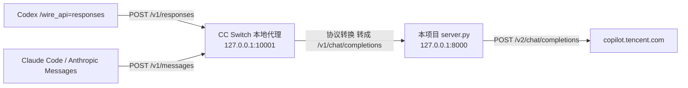

# 在 Codex / Claude Code 中使用（经 CC Switch 协议转换）

> 最后更新：2026-09-19
> 相关：[文档索引](README.md) ｜ [Fork 变更记录](FORK-CHANGES.md) ｜ [思考回放交接文档](2026-09-18_reasoning-replay-handoff.md)

## 一句话结论

可以接入，**本项目不需要改代码**。

Codex 0.155.0 只会说 Responses API（`wire_api` 的合法取值只有 `responses`），而本项目只提供
OpenAI Chat Completions（`/v1/chat/completions`）。这段协议差异交给 **CC Switch 的本地代理**：

CC Switch 支持把 `apiFormat` 为 `openai_chat` 的服务当作上游，会自动把客户端发来的
Responses / Anthropic 请求转换后再转发。所以只要把本项目作为一个 `openai_chat` provider
加进 CC Switch 就行。



## 一、先启动本项目

Windows（PowerShell）：

```powershell
.\start.ps1                    # 默认 8000 端口
.\start.ps1 -Port 9000         # 换端口
```

Linux / macOS：

```bash
./start.sh                     # 默认 8000 端口
PORT=9000 ./start.sh
```

启动前建议设一个 API Key（不设也能跑，但等于没有鉴权保护）：

```powershell
$env:API_KEY = "你自定的 key"
.\start.ps1
```

确认服务活着：

```bash
curl http://127.0.0.1:8000/health
# {"status":"ok","codebuddy_configured":true,"api_key_configured":true}
```

| 字段 | 期望 | 含义 |
|---|---|---|
| `codebuddy_configured` | `true` | token 加载成功（来自 `tokens.json` 或 `CODEBUDDY_AUTH_TOKEN`） |
| `api_key_configured` | `true` | 已设置 `API_KEY`，调用需带 `Authorization: Bearer <key>` |

## 二、在 CC Switch 里新增 provider

CC Switch → 新增供应商。**唯一要点：接口格式必须选 `openai_chat`。**

| CC Switch 字段 | 填什么 | 说明 |
|---|---|---|
| 应用 / App | `Codex` 或 `Claude` | 想在 Codex 用就选 Codex，想在 Claude Code 用就选 Claude |
| 名称 / Name | `WorkBuddy2API` | 随便起，只是个标签 |
| 接口格式 / API Format | **`openai_chat`** | 关键项。本项目是 OpenAI Chat Completions 兼容 |
| 基础地址 / Base URL | `http://127.0.0.1:8000/v1` | 端口要和 `start.ps1 -Port` 一致，**结尾必须带 `/v1`** |
| API Key | 启动本项目时设的 `API_KEY` | 若没设 `API_KEY`，这里填任意非空字符串即可 |
| 模型 / Model | `deepseek-v4-pro` 等 | 见第三节 |

界面上中英文叫法可能不同，认准底层字段名：`apiFormat` / `base_url` / `apiKey` / `model`。

> 若界面提供「拉取模型列表」，先启动本项目再点，会直接读到 `/v1/models` 的 28 个模型。

然后：

1. 确认 CC Switch 的 **本地代理（Local Proxy）** 已开启，监听 `127.0.0.1:10001`。
2. 把 Codex（或 Claude）的当前供应商切换成刚新增的 `WorkBuddy2API`。

切换后 CC Switch 会自动改写 `~/.codex/config.toml`（**不需要手动改**），形如：

```toml
model_provider = "custom"
model = "deepseek-v4-pro"

[model_providers.custom]
wire_api = "responses"
base_url = "http://127.0.0.1:10001/v1"
experimental_bearer_token = "PROXY_MANAGED"
```

注意 `wire_api` 仍是 `responses`、`base_url` 指向 10001：Codex 说的依然是 Responses API，
转换发生在 CC Switch 本地代理那一侧。**本项目收到的是已经转换好的 `/v1/chat/completions`。**

## 三、选哪个模型

模型名直接用 `/v1/models` 返回的名字。按 2026-09-18 实测：

| 类别 | 模型 |
|---|---|
| 有 `reasoning_content` 下行（推荐） | `deepseek-v4-pro`、`deepseek-v4-flash`、`deepseek-v3-2-volc`、`deepseek-r1`、`glm-5.1`、`kimi-k2.5`、`hunyuan-2.0-thinking`、`minimax-m2.7` |
| 无独立思考通道（不会输出思考） | `deepseek-v3`、`hy3-preview` |
| 上游已下架（已从清单移除） | `deepseek-r1-0528`、`deepseek-v3-1`、`glm-4.7`、`glm-5.0` |

想看到折叠的思考块，优先选第一类。

## 四、验证

```bash
# 1. 本项目直连（绕过 CC Switch）
curl http://127.0.0.1:8000/v1/models

# 2. CC Switch 本地代理是否活着
curl http://127.0.0.1:10001/health

# 3. Codex 走通最小闭环
codex exec --skip-git-repo-check "say hi"
```

多轮思考回放是否生效（需要 token，会真实调用上游）：

```bash
python docs/probe_reasoning_replay.py replay   # 期望 PASS
```

## 五、排错

| 现象 | 原因 / 处理 |
|---|---|
| `codebuddy_configured: false`，请求返回 503 | token 没加载到。确认 `tokens.json` 在项目根目录，或设置 `CODEBUDDY_AUTH_TOKEN` |
| 401 / `unauthorized client detected` | 这是 CC Switch 里**其他** provider 的上游报的错，不是本项目。确认当前选中的是新增的 `WorkBuddy2API` |
| 能连通但返回 404 | Base URL 少了 `/v1` |
| 首字很慢 | 首字延迟 = 上游首字延迟。推理模型要先思考，通常 1–3s。本项目已不做整体缓冲 |
| CC Switch 用量统计拿不到 token | 本项目已在流式收尾块透出 `usage`；想让上游统计更准，客户端可带 `stream_options: {"include_usage": true}` |

## 依据：为什么 CC Switch 能做这个转换

- CC Switch 的 provider 记录带 `meta.apiFormat` 字段，实测取值含 `openai_chat` /
  `openai_responses` / `anthropic`（本机 `cc-switch.db` 的 `providers` 表）。
- 本机已存在一个 `apiFormat = openai_chat` 的 Codex provider，说明「Codex（Responses 客户端）→
  openai_chat 上游」这条转换路径是 CC Switch 已有的用法。
- 开启本地代理后，CC Switch 会把 `~/.codex/config.toml` 的 `base_url` 指向
  `http://127.0.0.1:10001/v1` 并写入 `experimental_bearer_token = "PROXY_MANAGED"`，
  由代理注入真实上游密钥，说明请求确实经代理中转。

## 附：早期结论已作废

本文件 2026-09-18 版本曾写「Codex 无法接入，需要先给 `server.py` 实现 `/v1/responses`」。
那个结论只考虑了直连场景，**没有考虑 CC Switch 的协议转换能力**，现已更正：
本项目保持只提供 Chat Completions，Responses 转换由 CC Switch 承担。